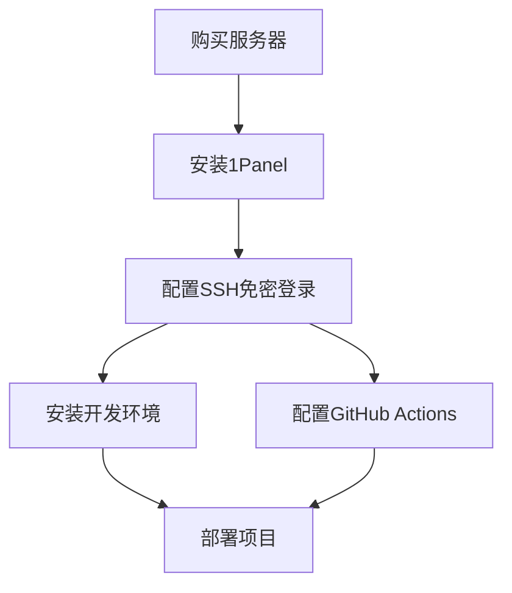

---
tags:
  - 技术文章
  - DevOps与基础设施
  - Linux系统管理
  - ubuntu
  - 服务器运维
series: 服务器运维
---
# 服务器购买后的第一步配置指南

## 🎯 购买服务器第一件事情

### 1. 安装运维面板

推荐安装 1Panel 或其他运维工具来简化服务器管理。

### 2. 服务器管理工具

对于管理多台服务器的需求，推荐使用 XTerminal 终端管理软件：
- 永久会员价格：120元
- 邀请码：**6666888**

### 3. 配置SSH免密登录

详细配置步骤请参考：[[02-SSH配置/SSH完整配置指南]]

### 4. 搭建开发环境

作为JavaScript开发者，推荐的开发环境搭建流程：

1. **安装换源工具** - 加速包下载
2. **安装Volta** - JavaScript工具管理器
3. **安装Node.js** - 使用Volta管理版本
4. **安装Bun** - 快速JavaScript运行时

详细步骤请参考：[[03-开发环境/Node.js开发环境搭建]]

---

## 🚀 快速开始流程

---

## 📚 相关文档

- [[01-服务器运维/Docker安装配置]] - 容器化环境搭建
- [[04-数据库配置/sql]] - MySQL/PostgreSQL等数据库安装
- [[01-服务器运维/docker使用]] - Docker基础操作和最佳实践
